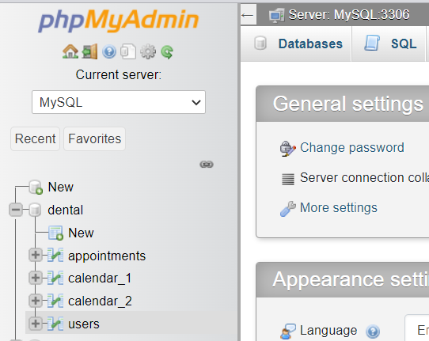
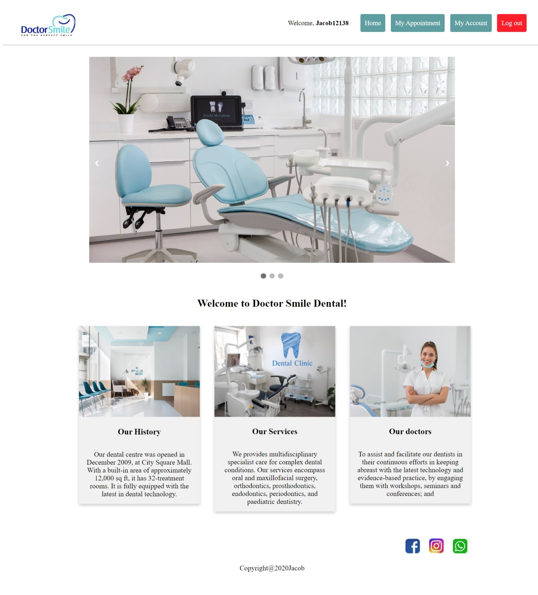
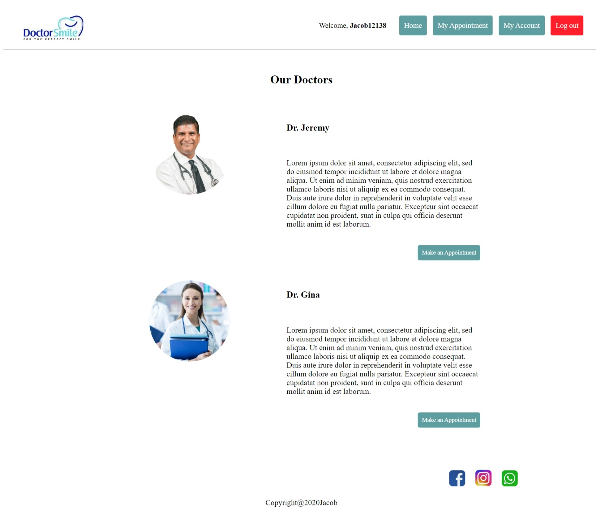
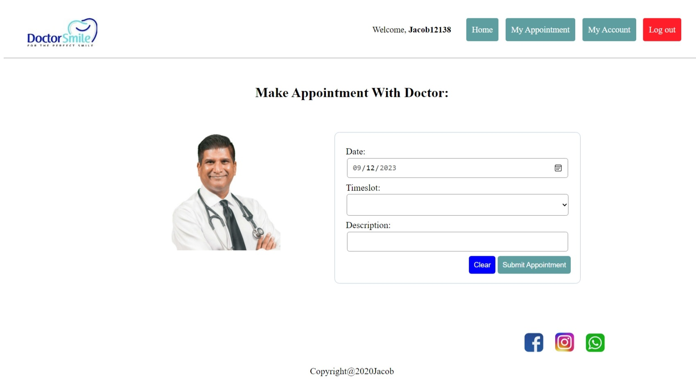
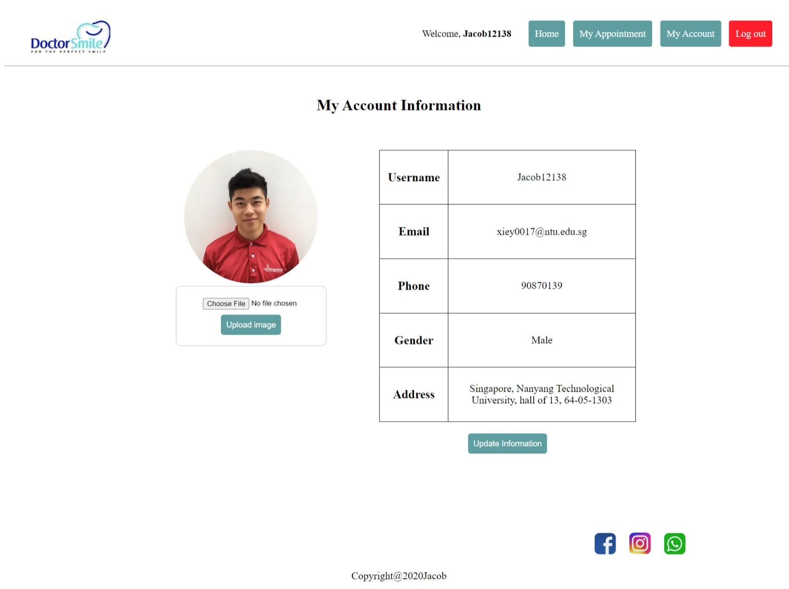
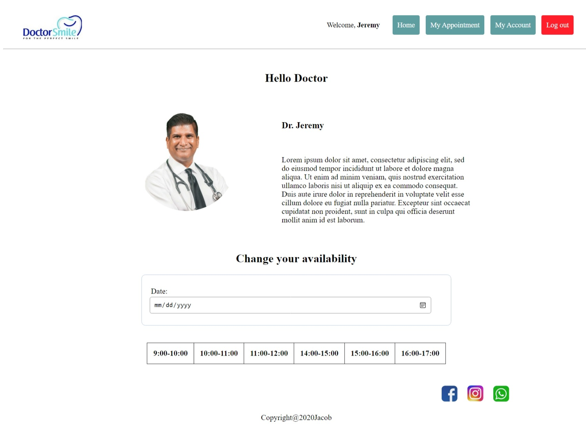
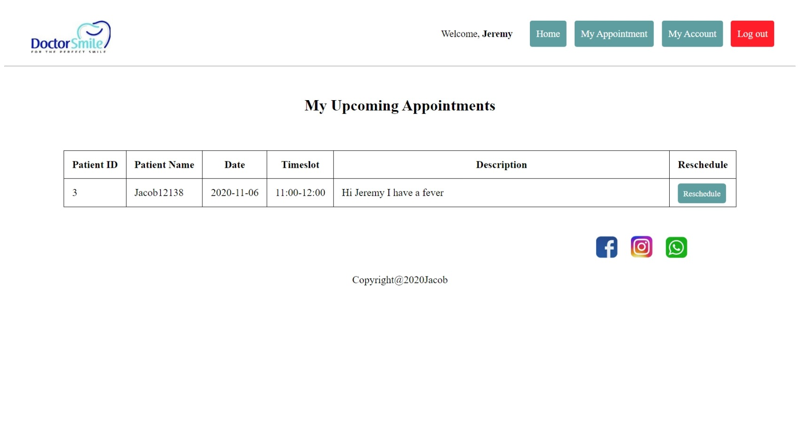

# Dental-appointment-System

### A system for manage company leave system based on HTML, Javascript, CSS, PHP, MySQL

## Usage:

### 1. Install WAMP server on Windows and run it

WampServer installs automatically install Apache, PHP, MySQL on Windows
https://www.wampserver.com/en/


### 2. Download (git clone) all files of this repo and unzip to WAMP 'www' folder

```git clone https://github.com/Jacob12138xieyuan/EE4717-dental-system.git```

For example: E:\wamp64\www\EE4717-dental-system

### 3. Import data into MySQL server

Go to 'http://localhost/phpmyadmin/', username is 'root', password is empty. On the left side create new database name as 'dental', and import data by selecting 'database/dental.sql' file in 'dental' folder. You should see blow:



### 4. Open web page form http://localhost/

Click 'EE4717-dental-system' link under 'Your Projects', you should see a login page. 

You can login as patient: username: Jacob12138, password: 123 or log in as doctor: username: Jeremy, password: 123, otherwise, you can sign up as a new user. 

#### After log in as patient, you should see:
Main page:

Doctors page:

Make appointment page:

Patient information page:


#### After log in as doctor, you should see:
Main page:

Doctor appointment page:



